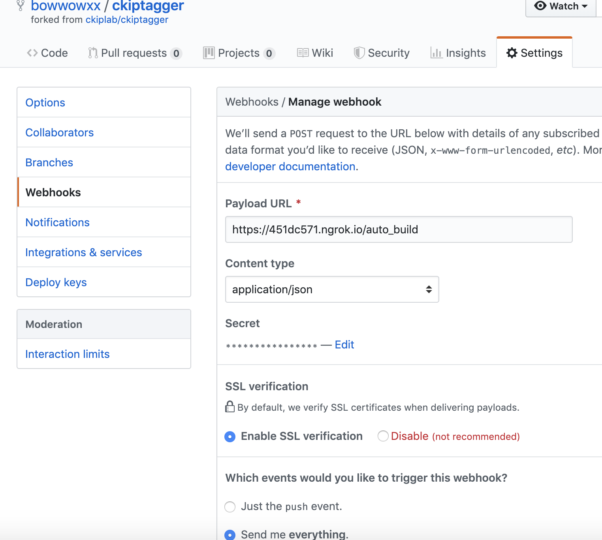

# Githubhook (for server use)

[](https://console.cloud.google.com/cloudshell/editor?shellonly=true&cloudshell_image=gcr.io/cloudrun/button&cloudshell_git_repo=https://github.com/bowwowxx/githubhook.git)

### 1.Use ngrok tunnels to localhost  

### 2.Run githubhook service  
 
**go build**  
```
CGO_ENABLED=0 GOOS=linux GOARCH=amd64 go build -o githubhook main.go
```

**run on server**
```
chmod +x githubhook && ./githubhook &
```

### 3.Setting github repository webhook  

 **Github page setting：**  
 

 **Run github hook server:**  
 
 
 **Check Log:**  
 ```
 tail -f /tmp/log
 ```
   


### 4.Verification Content  
HTTP POST、RequestUrl、 X-Hub-Signature、 x-github-event
Please refer to the config gile

